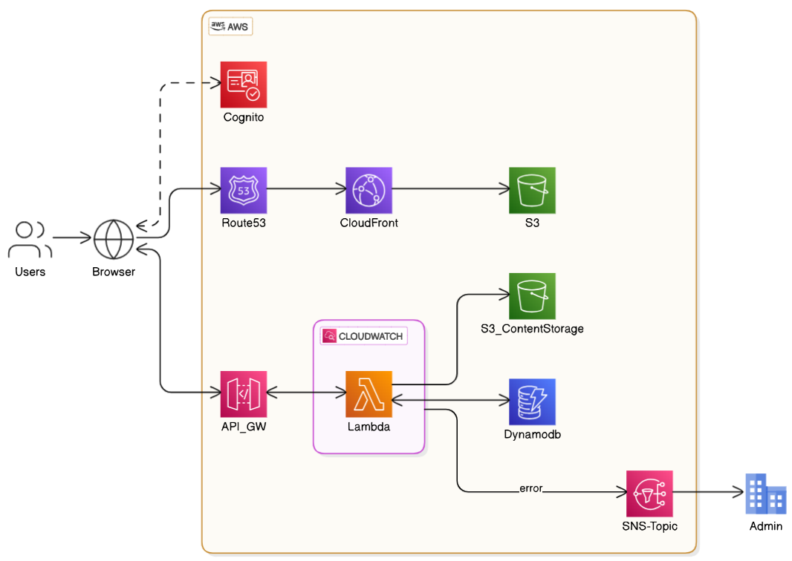

# 📚 Famelga Bookstore App 

This is a full-stack, serverless web application designed to allow users to upload, search, and download documents. The app is deployed using modern AWS cloud infrastructure with production-grade DevOps practices such as CI/CD pipelines, infrastructure as code, monitoring, and alerts.

---

## 🚀 Features

- ✅ **Upload PDFs, DOCX, EPUBs**
- 🔍 **Search documents** by text content using OpenSearch
- 📥 **Download** documents
- 👤 **Cognito authentication**
- 🧱 **Terraform-managed AWS infrastructure**
- 🔄 **CI/CD with GitHub Actions** for backend, frontend, and infrastructure
- 📈 **Monitoring & Alarms** using CloudWatch + SNS

⚙️ CI/CD Overview
Pipeline:Description
Terraform: Plan on PR, Apply on Merge to main with manual approval
Lambda: Deployment	On push to main, zip & deploy updated code
Frontend: Deployment	On frontend change, build & sync to S3 + invalidate CloudFront
Secrets:	AWS credentials & URIs stored in GitHub Secrets

☁️ AWS Services Used
✅ S3 (storage & hosting)
✅ DynamoDB (metadata)
✅ Cognito (auth)
✅ Lambda (compute)
✅ API Gateway (routing)
✅ CloudWatch (monitoring)
✅ SNS (alerting)

🛠️ Local Development
Prerequisites
* Node.js
* AWS CLI
* Terraform
* GitHub CLI